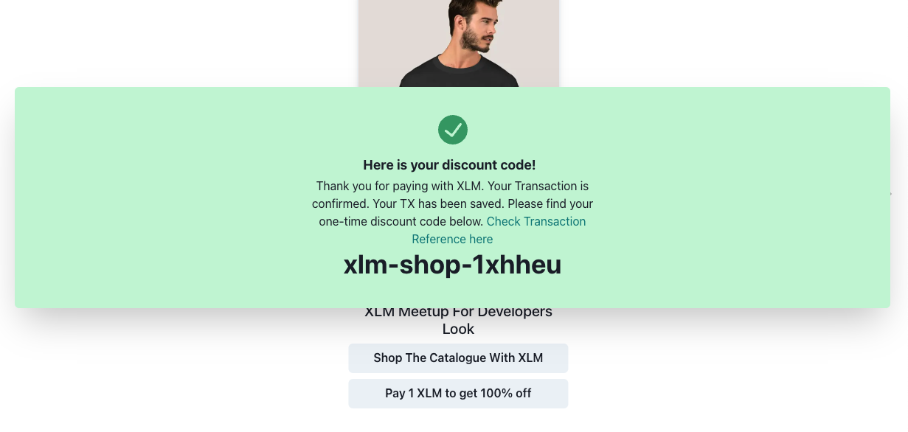

## XLM Shop Widget

Shopify Embed XLM Coupon Widget

## Demo

[Screencapture demo on Youtube](https://www.youtube.com/watch?v=jPjiM3ktRNY)

## Embed XLM Payment + Cupons Widget in Shopify

<table>
<tr><td>

</td>
</tr>
</table>

## Sign & Pay via Albedo

<table>
<tr><td>

</td>
</tr>
</table>

```javascript
import albedo from "@albedo-link/intent";

const payment = await albedo.pay({
  amount: price,
  network: process.env.REACT_APP_XLM_TRANSACTION,
  destination: "GAAHE4VBEAU34QXS5PUIX6KQRVM67Z6CSJDX5PFLKA5WASI7BS6MTPDA",
  submit: true,
});
set(
  produce((state) => ({
    ...state,
    xlmPaymentState: {
      ...state.xlmPaymentState,
      post: {
        ...INITIAL_XLM_STATE.post,
        loading: false,
        success: {
          ok: true,
          data: {},
        },
      },
    },
  }))
);
```

- Fetchings looks data using api request

```
-src
  |-store
    |-looks

```

```javascript
const { data } = await axios.get(
  `${process.env.REACT_APP_API_SERVER_URL}/api/get_looks?shop=${shop}&id=${id}`
);
```

- Display data in carousel using Recat Slick

```

-src
|-routes
|-Embed.js

```

- Look data to display in carousel

```javascript
<Carousel medias={look.medias} height={400} width={275} />
```

## Payment Modal Popup

- Parsing payment data to payment modal on click of payment button

```javascript
<XLMModal
  lookCryptoPrice={look.cryptoPrice}
  lookImage={look.medias}
  lookId={look.id || look.objectId}
  lookName={look.name}
/>
```

```
-src
 |- xlm-payment-modal
  |- index.js
```

- Fetching payment data using api by parsing shop name and lookId

  - will get product data, xlm price, qr-code for payment using albedo app

- once the payment is done will get the response from Albedo.

- post the transaction id get from payment response to verify

```javascript
const { data } = await axios.get(
  `${process.env.REACT_APP_API_SHOPLOOKS_SERVER_URL}/api/verify_xlm_payment?txid=${txid}`
);
```

- display the transaction response

```
-src
  |-components
    |-- xlm-payment-modal
      |--- discount.js
```

<table>
<tr>
<td></td>
</tr>
</table>

```
-src
  |-components
    |-- xlm-payment-modal
      |--- discount.js
```

## Payment Uusing Albedo app

- Install Albedo extension
- Click on Pay with XLM
- Review and sign the transaction
- you can see the transaction details in ALbedo extension
- After the transaction is completed you will see the success message screen with generated coupen code and link to see the transaction
